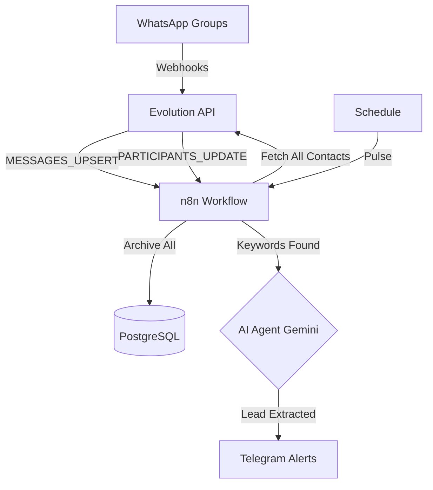

# Схема системы мониторинга и лидогенерации WhatsApp

Система построена на связке Evolution API + n8n + PostgreSQL.

## 1. Архитектура данных (Database Schema)

Для хранения 30к+ сообщений и тысяч контактов используем PostgreSQL.

### Таблица `contacts` (Контакты)
| Поле | Тип | Описание |
| :--- | :--- | :--- |
| `jid` | String (PK) | WhatsApp ID (номер@s.whatsapp.net) |
| `push_name` | String | Имя в WhatsApp |
| `source_group`| String | Из какой группы пришел впервые |
| `is_lead` | Boolean | Является ли потенциальным клиентом |
| `last_seen` | Timestamp | Когда последний раз писал или вступал |

### Таблица `messages` (Лог сообщений)
| Поле | Тип | Описание |
| :--- | :--- | :--- |
| `msg_id` | String (PK) | ID сообщения |
| `sender_jid` | String (FK) | Кто отправил |
| `group_jid` | String | В какой группе |
| `content` | Text | Текст сообщения |
| `timestamp` | Timestamp | Время отправки |
| `is_summarized`| Boolean | Обработано ли ИИ |

---

## 2. Логика воркфлоу (n8n)

### Workflow A: "New Member Guard"
1. **Webhook:** Перехватывает событие `GROUP_PARTICIPANTS_UPDATE`.
2. **Filter:** Если `action == "add"`.
3. **DB Action:** Записывает нового участника в таблицу `contacts`.
4. **Alert:** Если группа "элитная", шлет уведомление: "Новый потенциальный клиент вступил в группу Х".

### Workflow B: "Global Monitor & AI Summary"
1. **Webhook:** `MESSAGES_UPSERT` (все входящие из групп).
2. **DB Action:** Пишет всё в `messages`.
3. **Keyword Check:** Если есть "груз", "фура", "экспорт", "нужна машина".
4. **AI Node (Gemini 1.5 Flash):** Извлекает: Направление, Вес, Контакт.
5. **Notification:** Шлет в твой ТГ-бот готовый лид.

### Workflow C: "Contact Extractor" (По расписанию)
1. **Cron:** Раз в 24 часа.
2. **API Call:** `GET /group/participants/all`.
3. **Sync:** Сверяет всех найденных людей с базой `contacts`, добавляет новых.

---

## 3. Визуальная схема (Mermaid)

